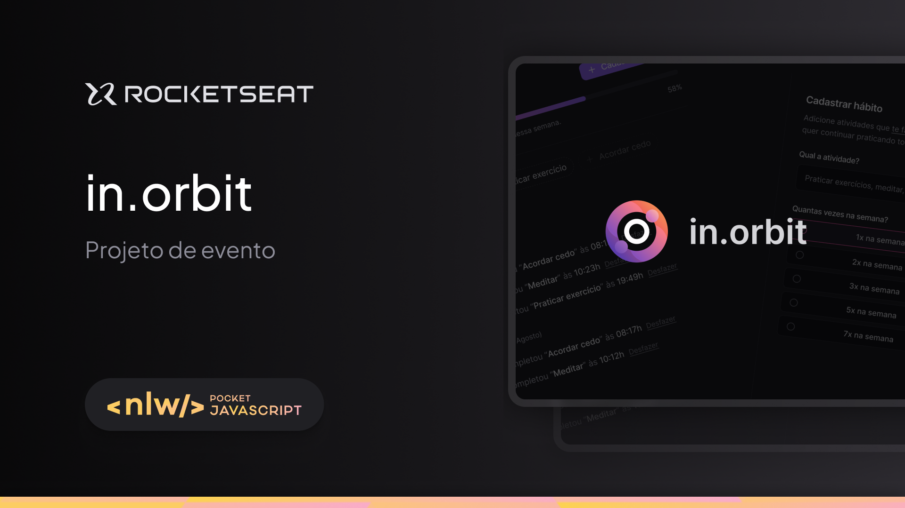

# Next Level Week 17 - Full Stack Application Overview

This project consists of a full-stack application developed during the 17th edition of the Next Level Week, held from September 9 to 11, 2024. It includes a React front-end application and a Fastify-based Node.js back-end API.

<div style="display: flex; with: auto; gap: 16px; justify-content: center">
    
</div>

## Project Overview

The application focuses on managing user goals. The front-end allows users to create, update, and monitor their goals, interacting with the back-end API for data persistence and retrieval. Key features include goal creation, tracking pending goals, and marking goals as completed.

---

## Front-End Application

The front-end of this application was developed using **React** and **Vite**. It provides a user-friendly interface for managing goals, allowing users to create new goals, view pending goals, delete goals, and mark them as complete.

### Technologies Used

- **React**: React: A popular JavaScript library for building user interfaces, enabling the development of interactive and dynamic web applications.
- **Vite**: A modern build tool that significantly enhances the development experience with fast hot module replacement (HMR) and efficient bundling for React applications.
- **Day.js**: A lightweight date library for date manipulation.
- **TailWind**: A utility-first CSS framework that allows for rapid UI development, enabling developers to style applications directly in their markup using pre-defined utility classes, promoting consistency and responsiveness.

### Installation and Setup

#### Prerequisites

- Node.js
- Docker

#### Installation

**Clone the Repository**

   ```bash
   git clone https://github.com/paullosergio/NLW-InOrbit.git
   cd NLW-InOrbit
   ```


#### Running the Application

   ```bash
  make run
   ```

#### Stopping the Application
   ```bash
  make stop
   ```

#### API Endpoints Overview

- **Get Summary**: Fetches a summary of the user's goals.
- **Create Goal Completion**: Marks a goal as completed.
- **Create New Goal**: Allows the creation of new goals.
- **Delete Goal**: Removes a goal.
- **Get Pending Goals**: Retrieves a list of pending goals.
---